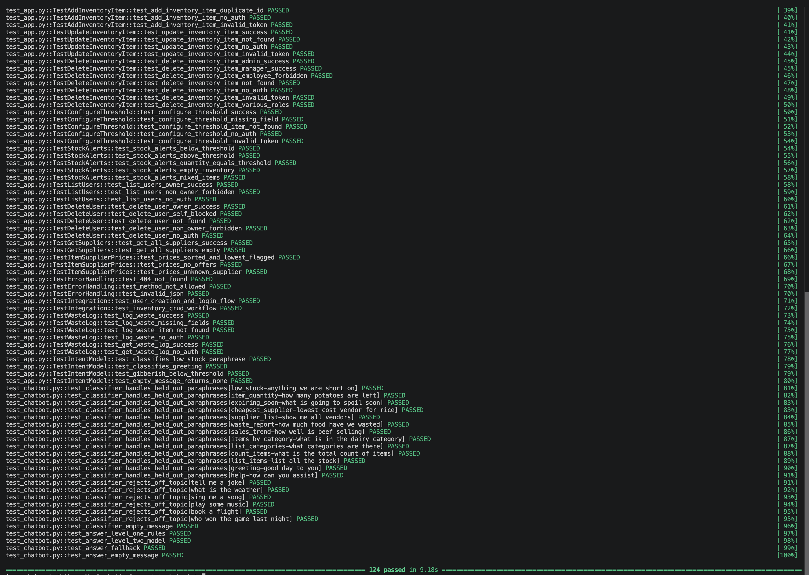
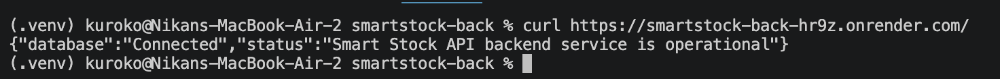

# Smart Stock — Backend API

### Accessible Supply Chain Intelligence for Small-Scale Restaurants.

**Smart Stock** is a lightweight, cloud-native web application that replaces manual inventory guesswork with AI driven precision. This repository contains the Python backend REST API, responsible for secure data persistence, authentication, and serving as the foundation for our AI predictive models. The application is deployed on Render and connected to a MongoDB Atlas cluster.

---

## Deployment Status





> Live API: `https://smartstock-back-hr9z.onrender.com`

---

## About the Backend

While the frontend delivers a seamless BYOD (Bring Your Own Device) experience, the backend acts as the secure engine driving the enterprise-grade analytics. It provides a robust, scalable RESTful architecture designed to handle inventory mutations, enforce strict Role-Based Access Control (RBAC), and process complex queries required by small-scale restaurants operating on thin margins.

## Key Features

* **Robust REST API:** Full CRUD operations for inventory items, categories, and stock thresholds.
* **Stateless Authentication:** Secure JWT-based (JSON Web Token) authentication paired with `bcrypt` password hashing to protect sensitive business data.
* **Role-Based Access Control (RBAC):** Middleware-enforced authorization separating Owner, Admin, Manager, and Employee privileges (e.g., only Admins and Managers can delete critical stock records).
* **Low-Stock Threshold Alerts:** Per-item minimum thresholds with an evaluation endpoint that surfaces every item at or below its safety floor, ready to drive stockout alert UIs.
* **Smart Sourcing:** Supplier registry and per-item price comparison endpoint that ranks vendor offers cheapest-first and flags the best deal.
* **AI NLP Assistant:** Two-level chat assistant — rule-based intent matching over live data, backed by a TF-IDF + cosine-similarity classifier for paraphrases the rules miss.
* **Demand Forecasting:** RandomForest pipeline with IQR outlier removal and moving-average smoothing; projects demand 7 days out with a confidence score.
* **Waste Log:** Full audit trail of discarded stock with per-entry attribution, timestamps, and reason tracking.
* **Cloud-Native Database:** Fully integrated with MongoDB Atlas for high availability, utilizing PyMongo with custom SSL/TLS bypass configurations for seamless Render deployments.

---

## Tech Stack

| Layer | Technology |
| --- | --- |
| **Language** | Python 3.10+ |
| **Framework** | Flask 3.0 |
| **Database** | MongoDB Atlas (NoSQL) |
| **Driver / ORM** | PyMongo |
| **Security** | PyJWT, bcrypt, Flask-CORS |
| **AI / ML** | scikit-learn (RandomForest, TF-IDF), pandas, numpy |
| **Testing** | pytest, pytest-mock (124 tests) |
| **Hosting** | Render (Gunicorn WSGI) |

---

## Project Structure

```
smartstock-back/
├── app.py              # Flask app: routes, db connection, auth middleware
├── chatbot.py          # /api/chat rules (level 1) + model routing (level 2)
├── intent_model.py     # TF-IDF + cosine intent classifier (level 2)
├── intents.json        # Example phrases per intent (grow this to improve)
├── forecast.py         # /api/forecast RandomForest demand pipeline
├── seed.py             # Seed collections, indexes, and mock data
├── prepare_ai_data.py  # Build historical_data from the Kaggle dataset
├── test_app.py         # pytest suite for the API (mocks the database)
├── test_chatbot.py     # Focused chatbot robustness suite
├── Assets/             # Deployment and test evidence screenshots
├── requirements.txt
└── .github/workflows/  # CI: run the pytest suite on push and PRs
```

Route handlers stay thin in `app.py` and delegate heavier logic to dedicated
modules (e.g. `chatbot.py`), which take the `db` handle as an argument so they
stay independent of the Flask app and easy to test.

---

## Getting Started

### Prerequisites

* Python 3.10 or higher
* pip (Python package manager)
* A MongoDB Atlas cluster URI

### Installation

1. Clone the repository and navigate to the project folder:

```bash
git clone https://github.com/NikanEidi/smartstock-back.git
cd smartstock-back
```

2. Create and activate a virtual environment:

```bash
python -m venv .venv
source .venv/bin/activate  # On Windows use: .venv\Scripts\activate
```

3. Install the required dependencies:

```bash
pip install -r requirements.txt
```

### Environment Variables

Create a `.env` file in the root directory and configure the following variables:

```env
MONGO_URI=mongodb+srv://<username>:<password>@cluster0...
PORT=8000
JWT_SECRET=your_super_secure_random_string_here
```

*Note: The `.env` file holds sensitive credentials and must never be committed. Make sure it is listed in `.gitignore`.*

### Database Seeding (First-time setup)

Initialize the MongoDB collections, enforce unique indexes, and generate mock data (including hashed admin credentials):

```bash
python seed.py
```

*Note: The default seed script generates two users: `nikan@smartstock.com` (Admin) and `junho@smartstock.com` (Manager) with pre-configured passwords.*

### Local Development

Run the Flask development server:

```bash
python app.py
```

The API will be available at `http://localhost:8000`.

### Testing

The backend ships with a full `pytest` suite of **124 tests** covering authentication, inventory CRUD, RBAC, threshold configuration, stock alerts, supplier pricing, waste log, NLP chat routing, and the TF-IDF intent classifier. Run all suites from the project root:

```bash
python -m pytest -v
```


*Note: Use `python -m pytest` (rather than a bare `pytest`) to ensure the suite runs inside the active virtual environment. The token fixtures read `JWT_SECRET` directly from the app, so tests pass regardless of the secret configured in your environment.*

---

## Core API Endpoints

### Health Check

* `GET /` — Returns backend status and MongoDB connection state.

```json
{
  "database": "Connected",
  "status": "Smart Stock API backend service is operational"
}
```


### Authentication

* `POST /api/users` — Register a new account.
* `POST /api/auth/login` — Authenticate and receive a JWT.
* `POST /api/auth/logout` — Invalidate client session.

### User Management (Owner only)

* `GET /api/users` — List all registered accounts (Owner only; passwords excluded).
* `DELETE /api/users/<email>` — Remove a user account by email (Owner only; self-deletion blocked).

### Inventory

* `GET /api/inventory` — Retrieve all stock items.
* `GET /api/inventory/<item_id>` — Retrieve a specific item.
* `POST /api/inventory` — Create a new item (Requires Auth).
* `PUT /api/inventory/<item_id>` — Modify an item (Requires Auth).
* `DELETE /api/inventory/<item_id>` — Discard an item (Admin / Manager only).

### Thresholds & Stock Alerts

* `PUT /api/inventory/<item_id>/threshold` — Set or revise an item's `minimum_threshold` (Requires Auth).
* `GET /api/inventory/alerts` — Retrieve every item sitting at or below its configured threshold.

```json
{
  "alert_count": 1,
  "items_at_risk": [
    {
      "item_id": 102,
      "item_name": "Olive Oil",
      "category": "Groceries",
      "quantity": 15.0,
      "minimum_threshold": 20,
      "expiry_date": null
    }
  ]
}
```

### Supplier Sourcing & Price Comparison

* `GET /api/suppliers` — Retrieve the full vendor registry.
* `GET /api/inventory/<item_id>/prices` — Return all supplier offers for an item, sorted cheapest-first, with the best offer flagged.

```json
{
  "item_id": 101,
  "offer_count": 3,
  "best_price": 2.10,
  "offers": [
    { "supplier_name": "Fresh Valley Distributors", "price": 2.10, "is_lowest": true },
    { "supplier_name": "Ontario Local Foods Inc",   "price": 2.45, "is_lowest": false },
    { "supplier_name": "Metro Wholesale Grocers",   "price": 2.80, "is_lowest": false }
  ]
}
```

### AI Modules

* `POST /api/chat` — Natural language operational assistant. Level 1 rule-based intent matching over live data, covering low stock, item quantity, item count, listing items/categories, items by category, suppliers, cheapest price, expiring items, sales trends, waste totals, plus greeting/help. When the rules miss, a level-2 TF-IDF + cosine-similarity model (`intent_model.py`, trained on `intents.json`) classifies the intent and the same handler answers.
* `POST /api/forecast` — Demand forecasting endpoint (Requires Auth). Runs a RandomForest pipeline with IQR outlier removal and 3-period moving-average smoothing; projects demand 7 days ahead with a confidence score derived from MAPE.

```json
{
  "item_id": 42,
  "predicted_demand": 53.4,
  "confidence_level": 0.91,
  "message": "Demand forecast generated successfully"
}
```

### Waste Log

* `POST /api/waste` — Record a discarded item (Requires Auth). Expects `item_id` and `quantity`, plus an optional `reason`; the backend resolves the item name and stamps the logging user and timestamp.
* `GET /api/waste` — Retrieve every waste log entry, newest first (Requires Auth).

---

## Deployment

The backend is deployed as a Web Service on **Render**. Pushes to the `main` branch trigger automatic deployments using Gunicorn as the production WSGI HTTP server.

```bash
# Production execution command
gunicorn app:app
```

> Live URL: `https://smartstock-back-hr9z.onrender.com`